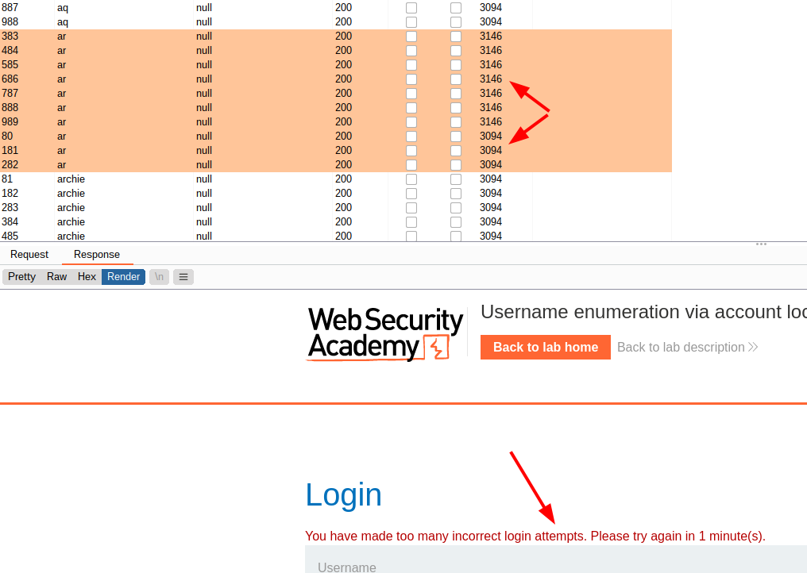
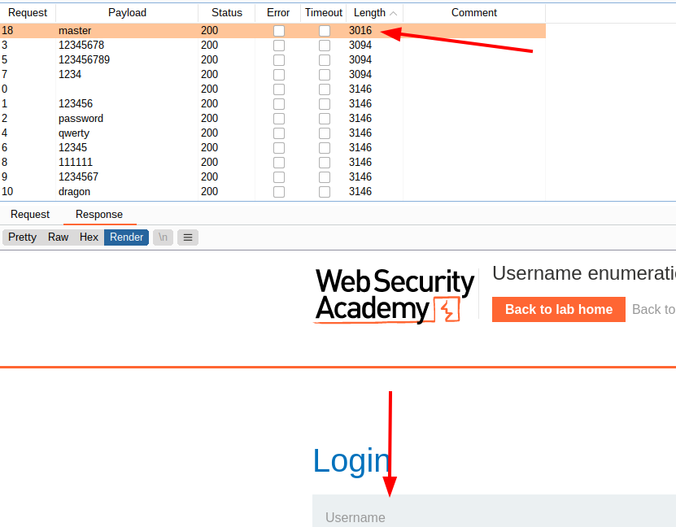

# Lab: Username enumeration via account lock

Lab-Link: <https://portswigger.net/web-security/authentication/password-based/lab-username-enumeration-via-account-lock>  
Difficulty: PRACTITIONER  
Python script: [script.py](script.py)  

## Known information

- Login functionality uses account locking after too many invalid login attempts
- Flaw in the login allows username enumeration and password brute-force
- Goals:
  - Enumerate valid username
  - Brute-force the password
  - login with these credentials

## Steps

### Enumerate username

As a first step I want to find out some basics about the account lockout. It states account lockout, so I guess it is based on actual usernames, but to verify I try to login with an (allegedly) invalid username and see if it locks me out based on my IP.

For this, I use the null payload option to generate 50 login attempts. But even after the 50th request, it still states 'Invalid username or password' and does not mention any lockout.

- Attack type: **Sniper**
- Payload: Null payloads, 50 times

That means it does not trigger based on login attempts from one source, but on existing accounts only. So lets repeat the last step, this time make multiple requests for each possible username and see whether there is a different behaviour or message.

- Attack type: **Cluster Bomb**
- Payload 1: the provided candidate usernames
- Payload 2: Null payloads, 10 times

After this runs through, most responses have a length of 3094, but for one username there are a couple of responses with a different length:

It can also be seen that I have 3 attempts before the lockout occurs.

Enumerated username: **ar**

### Find the password

As the lockout is just one minute, and the potential password list is small it would be possible to just brute-force our way in by waiting for one minute after each third attempt. However, I suspect that is not the correct solution here.

So now that a username is known let's see what happens if I try to brute-force it

- Attack type: **Sniper**
- Payload 1: the provided candidate passwords

The result is somewhat unexpected. There are the expected 3 attempts with the 'Invalid username or password' response, there are the remaining attempts with the 'You have made too many incorrect login attempts'-message, and there is a single response without any error message.

So wait one minute and test whether this is the correct password, and

Found password: **master**

