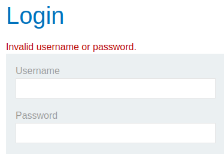

# Write-up: Username enumeration via response timing @ PortSwigger Academy

This write-up for the lab *Manipulating the WebSocket handshake to exploit vulnerabilities* is part of my walk-through series for PortSwigger's Web Security Academy.

Lab-Link: <https://portswigger.net/web-security/authentication/password-based/lab-username-enumeration-via-response-timing>  
Difficulty: PRACTITIONER  
Python script: [script.py](script.py)  

## Lab description

- Login mechanism vulnerable to brute force
- Timing differences exist during login
- Known good credentials  `wiener:peter`
- Lists of possible usernames and passwords are provided

### Goals

  - enumerate a valid user
  - brute force the corresponding password
  - log in and access account page

## Enumerate username

As a first step, I go to the page and try to log in with some random username and password. As expected, the error message is a generic `Something is wrong` message:

The next step appears simple. The lab description mentions a timing difference, so I load the request into Intruder, load the provided username list and add the known good username `wiener`.

- Attack type: *Sniper*
- Payload: *provided username list* + `wiener`

Unfortunately, this does not result in a serious difference in response times. Upon closer look it becomes obvious why:

The hint provided mentions that doing some simple HTTP request header manipulation can bypass this brute force protection. A quick Google search leads to [a page with the correct answer](https://medium.com/r3d-buck3t/bypass-ip-restrictions-with-burp-suite-fb4c72ec8e9c): the `X-Forwarded-For` header.

Adding it with a random value `X-Forwarded-For: abc123` will allow for further login attempts. I guess that using a static value there will just lock it up again, so include this value in the intruder. Using the Battering ram attack type, the `X-Forwarded-For` header will contain the username in each request, providing unique values and bypassing the lockout.

- Attack type: *Battering ram*
- Payload: *provided username list* + `wiener`

Unfortunately, the results are still inconclusive. The response time ranges from 68ms to 132ms. The one known correct username `wiener` is right in the middle of the response time with 93ms.

The one parameter that is definitely checked for valid usernames is the password field. Try using some absurdly long password (other parameters as above) and see how it goes:

Finally, some useful response:

Valid username: **athena**

### Brute force password

Now repeat the step for the password until the correct password ist found. Change the value of the `X-Forwarded-For` header to avoid repeating the values of the username enumeration.

- Attack type: *Battering ram*
- Payload: *provided password list*

On a successful login, the page redirects, so remove all responses with 2xx status codes (alternative, filter for responses not containing 'Invalid username or password'

Password for user: **555555**

### Login

Log-in with the username and password combination (if the browser is still on lockout, intercept the request and manually add the header), or simply use Burps 'Request in browser' feature to avoid typing results in:

