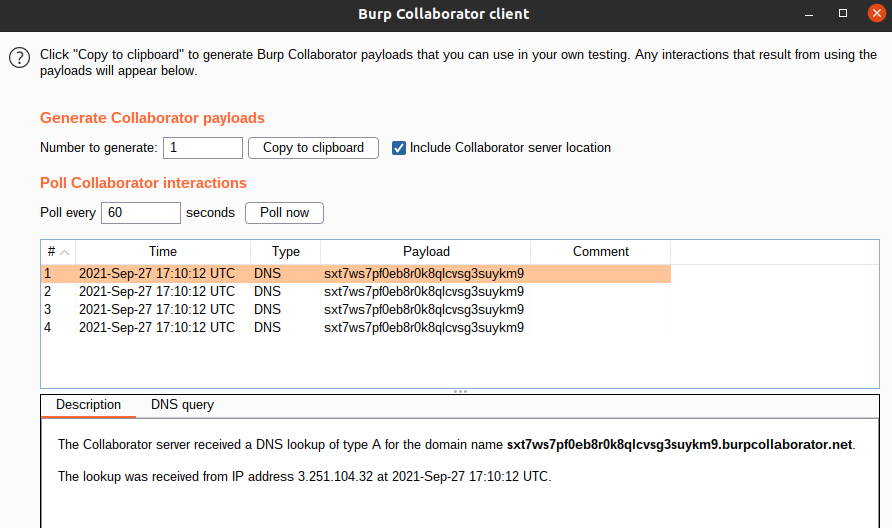

# Lab: Blind OS command injection with out-of-band interaction

Lab-Link: <https://portswigger.net/web-security/os-command-injection/lab-blind-out-of-band>  
Difficulty: PRACTITIONER  
Python script: Currently no script

## Known information

- OS command injection vulnerability in the feedback feature
- Application call a shell command with user input. Execution is asynchronous and has no observable impact on the application
- Goals:
  - Issue a DNS lookup to Burp Collaborator

## Steps

As with the previous labs in this section, I first have a look at the website and its feedback feature. I submit a feedback and send the request to repeater. As the lab is about how to send an out-of-band request, I assume that the attack vector is the same as in the other labs: the email input field.

Therefore I open a new Burp Collaborator client (in the menu `Burp --> Burp Collaborator Client`) and generate a new payload. URLencode the payload to avoid breaking the request.

After sending the request and poll for collaborator interactions, 4 DNS lookups are shown.

At the same time, the lab page updates to

