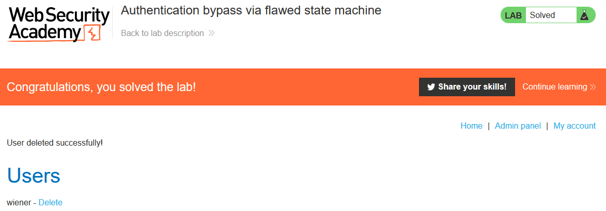

# Lab: Authentication bypass via flawed state machine

Lab-Link: <https://portswigger.net/web-security/logic-flaws/examples/lab-logic-flaws-authentication-bypass-via-flawed-state-machine>  
Difficulty: PRACTITIONER  
Python script: [script.py](script.py)  

## Known information

- Application makes flawed assumption about workflow order during the login process
- Known credentials `wiener:peter`
- Goals:
  - Access the admin interface
  - Delete user `carlos`

## Steps

### Analysis

And I'm back at the shop website. After looking around, I log in with the known credentials. What immediately jump to attention is that the login is now a two stage process. After providing username and password, I can select the role I want to login as:

Such an option definitely makes sense. It allows users with higher privileges to restrict their permissions when they don't need them. This reduces both the attack surface during everyday activities as well as the risk of expensive mistakes. At least, if done properly (easier and less error prone is having two dedicated accounts for this).

In any case, lets see how the requests look like, especially the `role-selector` one:

### Attempt 1: Adjust role

The second login stage contains the user role. The roles available to me are listed in the page. I don't know whether another check is done during the POST of this form.

What happens if I change the role to 'admin' or 'administrator'. Of course, I don't know the role names, but it is worth a try.

Unfortunately, this does not lead to anything, neither error nor more privileges. This indicates that on processing that POST, it validates against allowed roles and defaults to something that is not admin (perhaps one of my allowed roles).

### Attempt 2: Drop request

Speaking about defaulting, what happens if the full second request is dropped? Common sense would indicate that the session is dropped if any request is made before the second stage is finished. Easy to find out.

Logging in with `wiener:peter`, dropping the request to `/role-selector` and manulally browsing to `/my-account` shows the application refuses common sense and defaults to admin:

Now simpy go to the Admin panel and delete user `carlos` to solve the lab:

