# Lab: Infinite money logic flaw

Lab-Link: <https://portswigger.net/web-security/logic-flaws/examples/lab-logic-flaws-infinite-money>  
Difficulty: PRACTITIONER  
Python script: [script.py](script.py)  

## Known information

- Application has logic flaw in the purchasing workflow
- Known credentials `wiener:peter`
- Goals:
  - Purchase a Lightweight l33t leather jacket"

## Steps

### Analysis

I'm back at my favourite shop website, trying to purchase a jacket that I already have a few thousands of. As usual I start with browsing the page a bit and logging in with my known credentials.

The shop itself looks very familiar, but my account page has a new features - gift cards. Additionally, the lab provides access to my emails.

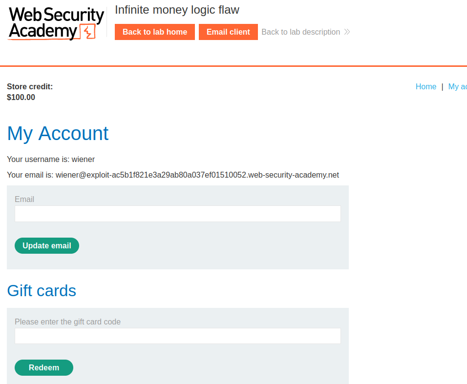

The gift cards can be purchased for \$10.

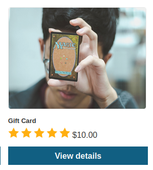

To find out how this works, simply buy one:

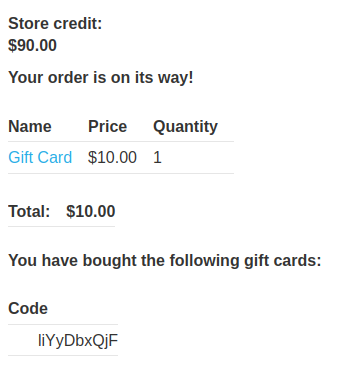

At the same time, I received an email, also containing the gift card code:

On the 'My account' website I can apply the gift card to bring my store credit back up to \$100. Unfortunately, I can not apply the gift card a second time. The gift card code can also not be used as coupon on the checkout page.

Nothing obviously fishy comes up upon checking the requests in Burp.

### Subscribing to newsletter

The other option that is still here is the newsletter. Lets find out what the subscription reward is this time:

It is again a 30% discount. This makes me think... The gift card states \$10 flat rate value, can I apply the 30% on this? (after all, all shops I know exclude gift cards explicitly from discounts)

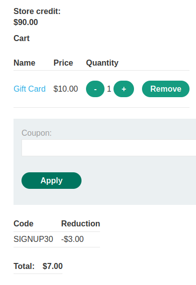

At least it can be applied, so I buy it. After the code is generated and applied in my account, the store credit total shows \$3 higher than before (actually \$13 higher as I forgot to apply another gift card before):

So for \$7 I can purchase a \$10 gift card that redeems for face value.

### Purchasing gift cards

For the \$103 I have in store credit, I can purchase 14 gift cards, generating a \$3 profit each and a total of \$42

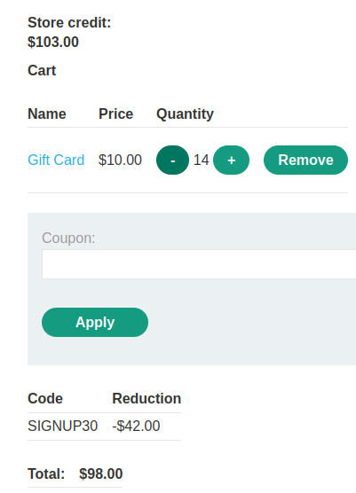

To obtain the \$1234 required to purchase the leather jacket, I need to redeem 412 gift cards. Nothing I want to do manually

### Create a macro

First thing is selecting the proper requests for a macro.

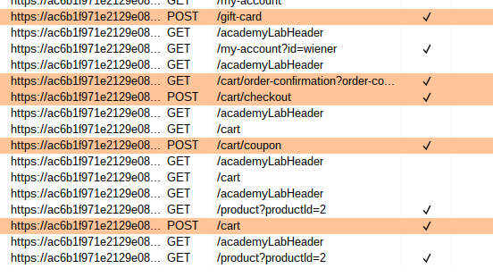

The POST to `/cart` does not contain a csrf-token, but the one to `/cart/coupon` does. So I modify the first request to `/cart` to redirect to `CART`, so that the csrf-token for the next request can be extracted.

On the first test of the macro, redemption of the gift card failed. Naturally, as I forgot change the gift card code to be taken from the previous request

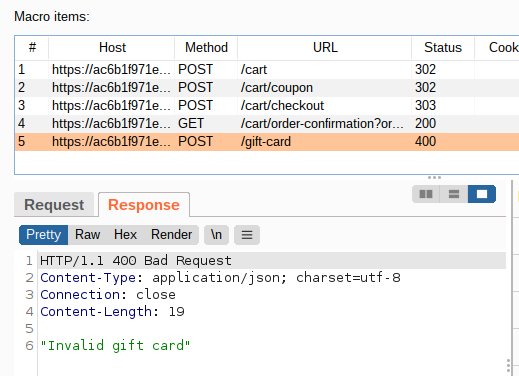

So manually redeeming the code on the website to obtain my \$3, then changing the macro to obtain the value from the previous request:

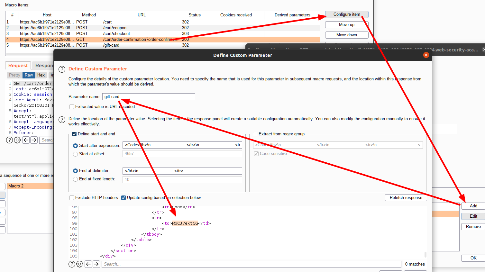

And the request to redeem the gift card needs to be updated to actually use that value:

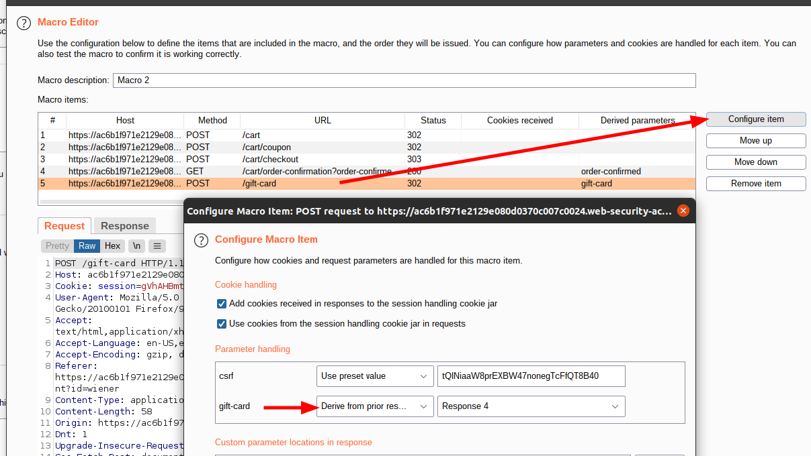

Now retest again

Now the macro test is successful, the parameter is obtained automatically and the gift card is applied. So i create a session rule that runs this macro for every request:

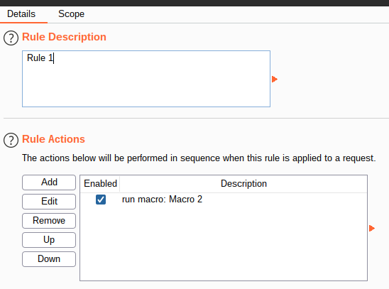

and send a plain request to `/my-account` to Burp Intruder. Clear all payload positions and add one for null payloads. During testing, I obtained already some of the 412 gift cards required, but use that number nontheless as number of payloads generated.

In addition, the requests must be made in order, so I use a resource pool with only a single concurrent requests:

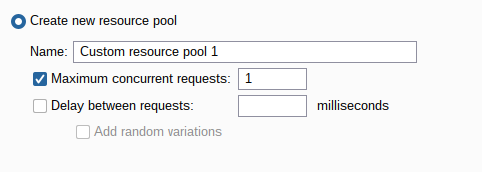

- Attack type: **Sniper**
- Payload: Null payload, 412 times

While the attack is running, refreshing of the account page in the browser shows a steady increase in store credit. So let it run for a while...

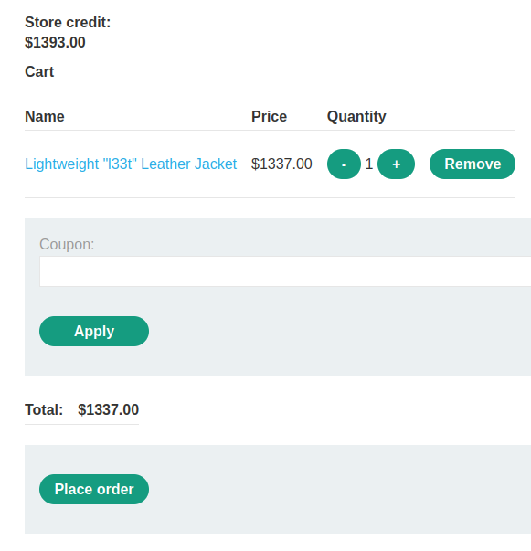

After it is finished, the cart looks much nicer for me and I can order. And I have no idea why I did not apply the discount code here, would have saved quite a number of calls.

