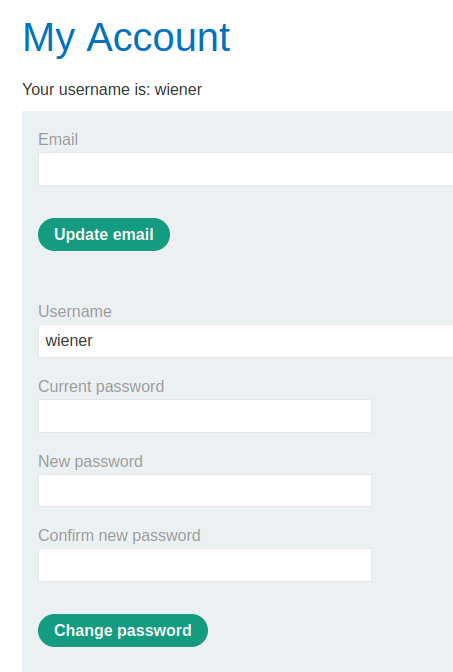
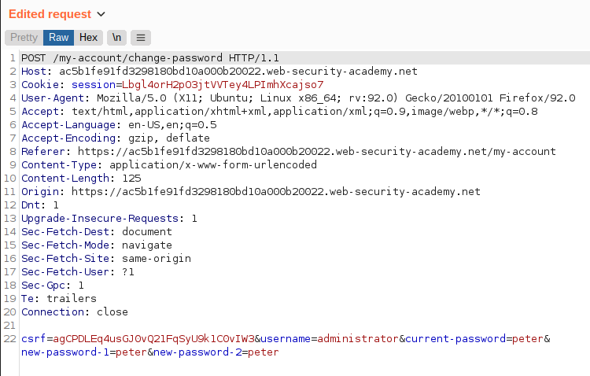

# Lab: Weak isolation on dual-use endpoint

Lab-Link: <https://portswigger.net/web-security/logic-flaws/examples/lab-logic-flaws-weak-isolation-on-dual-use-endpoint>  
Difficulty: PRACTITIONER  
Python script: [script.py](script.py)  

## Known information

- Application makes flawed assumption about user privileges based on the inputs
- Access to arbitrary user accounts possible
- Known good credentials `wiener:peter`
- Goals:
  - Access account of `administrator`
  - Delete user `carlos`
  
## Steps

### Analysis

As usual, the first step is to analyse the website. It is the blog system seen in earlier labs. After browsing a bit, I log into my known account.

One thing that immediately catches my eye is the password change functionality:

Why it contains the username as input field? What happens if I use it and change the username to `administrator`?

It basically states the change failed due to a wrong current password, but states that my username is administrator. Reloading `my-account` states `wiener` again. The error message is expected, the `your username is: administrator` is very much unexpected as it means that at some point during the generation of the response, the application assumed my username is `administrator`. Some weird coding goes on in there. Just be be sure I logout and try to login with `administrator:peter`, but it failed as expected.

Move over to Burp to have a look how all the request look like:

OK, so I have the csrf token, username and the three password parameter. While the application generated the response, at the moment my username was embedded, I was administrator. Somewhen after that point, the current password was checked and the error message was inserted and, obviously, the password change did not occur.

So what happens if I remove the current password from the form? It basically depends on whether it always checks the current password on password change (than it will fail as it should) or whether the password check only happens when the parameter is present (which would be good for me and bad for the application). Easy to find out, send it to Repeater:

Interestingly, the `my-account` page still states that I am `wiener` but I notice that I do not have a logout link. Reloading the page brings it back. So something happened with the response of my password change request that was not following the normal workflow.

Try to logout and login with `administrator:peter` again

And I appear to be inside the administrator account. Attempt to access the admin panel and delete carlos:

