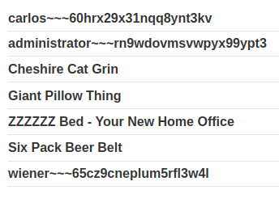
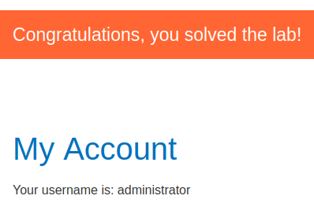

# Lab: SQL injection UNION attack, retrieving multiple values in a single column

Lab-Link: <https://portswigger.net/web-security/sql-injection/union-attacks/lab-retrieve-multiple-values-in-single-column>  
Difficulty: PRACTITIONER  
Python script: [script.py](script.py)  

## Known information

- vulnerable to SQL injection in the product category filter
- UNION based vulnerability
- database contains `users` table containing columns `username` and `password`.
- Goals:
  - Retrieve all usernames and passwords
  - Log in as `administrator`

## Query

The query might be something like

```sql
SELECT * FROM someTable WHERE category = '<CATEGORY>'
```

## Steps

### Confirm injectable argument

The first steps are identical with the labs [SQL injection UNION attack, determining the number of columns returned by the query](../SQL_injection_UNION_attack,_determining_the_number_of_columns_returned_by_the_query/README.md) and [SQL injection UNION attack, finding a column containing text](../SQL_injection_UNION_attack,_finding_a_column_containing_text/README.md) and are not repeated here.

The number of colums in the result is 2, with just the second being a text column.

### Find database used

We want to extract usernames and passwords, while only having a single string column. We can concatenate multiple values into single fields. The syntax depends on the database engine, so find out which database is used to drive the page.

Portswigger has a nice [cheat sheet](https://portswigger.net/web-security/sql-injection/cheat-sheet) which contains database version queries.

Luckily, the second attempt is successful, this query results in the database details.


### Extracting usernames and passwords


### Extracting usernames and passwords

We know which table (`users`) contains the credentials (columns `username` and `password`). We have just a single string columns, so we can either issue two queries (ordering them identical) and manually combining the data, or concatenate these values into a single string to be able to extract them in one go.

The latter version is much more convenient. Fortunately, the [cheat sheet](https://portswigger.net/web-security/sql-injection/cheat-sheet) mentioned above also contains the information required:


To be able to distinguish username from password, we also need to concatenate some unique-ish string in between. So the injected SQL query will be this:

```sql
SELECT * FROM someTable WHERE category = 'Accessories' UNION (SELECT null,username || '~~~' || password FROM users)--
```

Resulting in three user credentials:



Now log in as administrator and:


